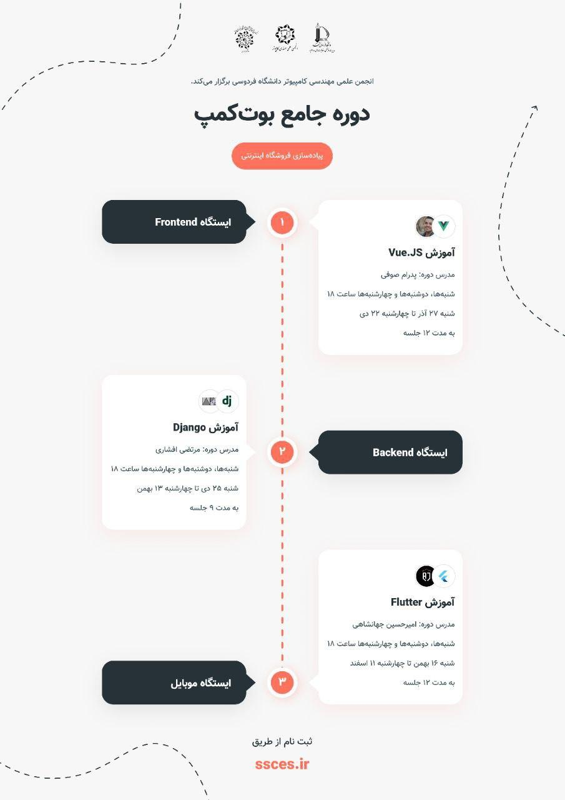

# FUM Bootcamp Course Project

> **📚 Educational Project** - This is a teaching/learning example project created for **FUM Bootcamp** (Ferdowsi University of Mashhad) students. It demonstrates fundamental Vue.js concepts and is not intended as production-ready code.



> **📸 Adding the Poster**: Place your bootcamp poster image as `bootcamp-poster.jpg` (or `.png`) in a `docs/` folder at the project root. Alternatively, you can place it in `src/assets/images/` and update the path above to `./src/assets/images/bootcamp-poster.jpg`.

## Overview

This project is a simple article management application built with Vue.js 2, designed to teach students core concepts of frontend development as part of the **FUM Bootcamp** program at Ferdowsi University of Mashhad. It includes authentication, CRUD operations, routing, and state management.

## 🎯 Learning Objectives

This project demonstrates:

- **Vue.js 2 Fundamentals**: Components, directives, lifecycle hooks
- **Vue Router**: Navigation, route guards, nested routes
- **Vuex**: State management patterns
- **API Integration**: Axios for HTTP requests
- **Authentication Flow**: Login, registration, and protected routes
- **Component Architecture**: Reusable components and composition
- **SCSS Styling**: Modular styles and variables
- **Form Handling**: Form validation and submission

## ⚠️ Important Note

This is **educational code** written during teaching sessions. It prioritizes clarity and learning over production best practices. The code structure is intentionally simple to help students understand concepts without overwhelming complexity.

**Not suitable for:**
- Production deployment
- Advanced architecture reference
- Best practices demonstration

**Suitable for:**
- Learning Vue.js basics
- Understanding common patterns
- Teaching material reference
- Student practice projects

## 🚀 Getting Started

### Prerequisites

- Node.js (v12 or higher)
- npm or yarn

### Installation

```bash
# Install dependencies
npm install
```

### Development

```bash
# Start development server
npm run serve
```

The application will be available at `http://localhost:8080`

### Build

```bash
# Build for production
npm run build
```

### Linting

```bash
# Lint and fix files
npm run lint
```

## 📁 Project Structure

```
src/
├── assets/           # Static assets (fonts, images, styles)
├── components/       # Reusable Vue components
├── constants/        # Application constants
├── middlewares/      # Route middleware (auth guards)
├── plugins/          # Vue plugins (axios, cookies, notifications)
├── router/           # Vue Router configuration
├── services/         # API service layer
├── store/            # Vuex store and modules
└── views/            # Page components and routes
    ├── auth/         # Authentication pages (login, register)
    └── articles/     # Article management pages
```

## 🛠️ Tech Stack

- **Vue.js 2.6** - Progressive JavaScript framework
- **Vue Router 3** - Official router for Vue.js
- **Vuex 3** - State management library
- **Axios** - HTTP client
- **SCSS** - CSS preprocessor
- **js-cookie** - Cookie management
- **Vue Notification** - Toast notifications

## 📝 Features

- ✅ User authentication (login/register)
- ✅ Protected routes with middleware
- ✅ Article listing
- ✅ Create new articles
- ✅ View article details
- ✅ Delete articles
- ✅ Responsive design
- ✅ Persian/Farsi font support

## 🔧 Configuration

The application requires a backend API. Update the base URL in:
```
src/constants/general.js
```

## 📚 Concepts Demonstrated

### Routing
- Route configuration
- Nested routes
- Route guards/middleware
- Programmatic navigation

### State Management
- Vuex store setup
- Modules
- Actions, mutations, getters

### API Integration
- Service layer pattern
- Axios configuration
- Error handling
- Request interceptors

### Authentication
- Token-based auth
- Cookie management
- Protected routes
- Auth middleware

## 🤝 Contributing

This is a teaching project. If you're a student or instructor and want to improve the examples, feel free to suggest changes or submit improvements that help with learning clarity.

## 📄 License

This project is provided as-is for educational purposes.

## 👨‍🏫 About

Created as teaching material for **FUM Bootcamp** students at Ferdowsi University of Mashhad.

### Bootcamp Information

- **Institution**: Ferdowsi University of Mashhad (FUM)
- **Program**: FUM Bootcamp
- **Focus**: Frontend Development with Vue.js

---

**Remember**: This code is for learning purposes. For production applications, consider more robust architecture, error handling, testing, and security practices.
